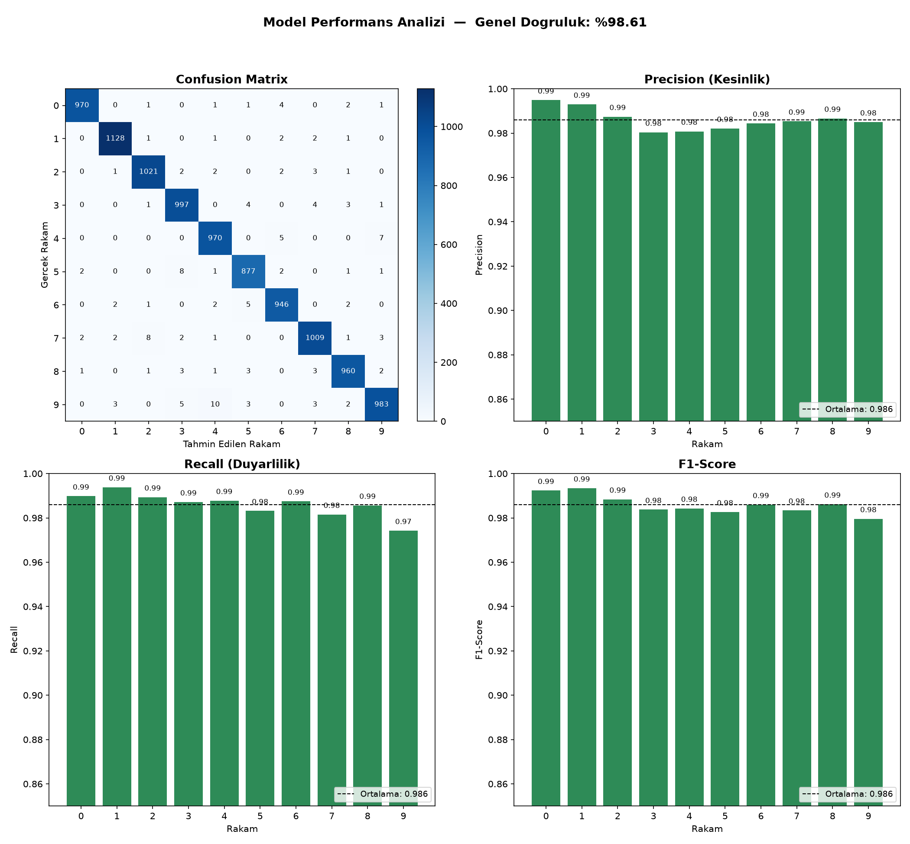
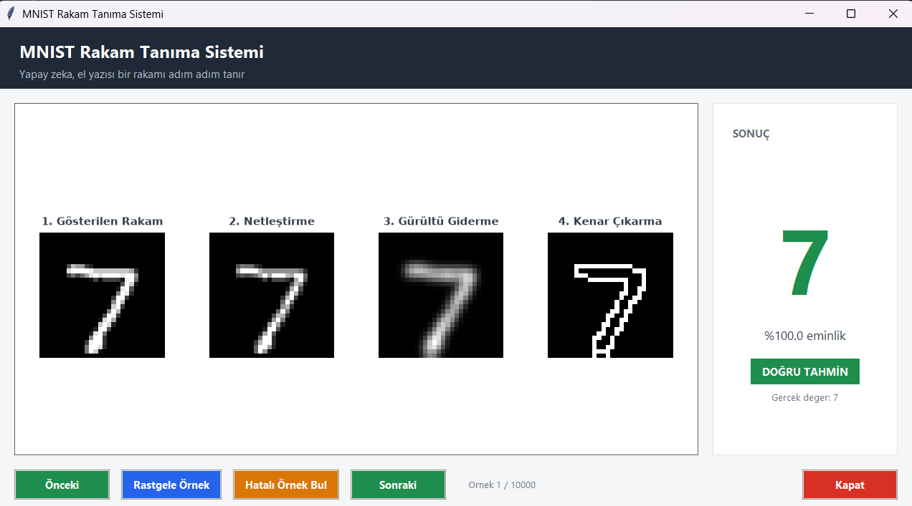

# MNIST Rakam Tanıma (ANN + Görüntü İşleme)

El yazısı rakamları (0-9) tanıyan bir yapay sinir ağı projesi. Standart "ham piksel → model" yaklaşımı yerine görüntü işleme tabanlı bir ön işleme hattı kullanılır ve optimizasyon, modelin en çok karıştırdığı **3, 5, 8 ve 9** rakamlarına odaklanır.

**Sonuç:** test setinde yaklaşık **%98.6 doğruluk** (ilk sürümde %96.0 idi).



## Arayüz

Uygulama, bir rakamın model tarafından tanınma sürecini adım adım gösterir: orijinal görüntü, netleştirme, gürültü giderme, kenar çıkarma ve sonuçta tahmin, eminlik yüzdesi ve doğru/yanlış durumu.



## Neler yapıldı?

- **Görüntü ön işleme hattı:** Histogram eşitleme → Gaussian Blur (5×5) → Canny kenar bulma (50/150).
- **Hibrit girdi:** Ham piksel (784) ve kenar haritası (784) birleştirilerek 1568 boyutlu girdi oluşturuldu. Canny'nin kavisli rakamlarda kaybettiği bilgi geri kazanıldı.
- **Hedefe odaklı seçim ölçütü:** Deneylerde genel doğruluk yerine 3, 5, 8, 9 rakamlarının ortalama F1 skoru esas alındı.
- **Aşamalı hiperparametre araması:** Önce ön işleme, sonra dropout, sonra mimari; her aşamada bir önceki en iyi sonuç sabitlenir.
- **Veri artırma:** Dönme (±10°), kaydırma (%10) ve zoom (%10) ile eğitim seti ikiye katlandı.
- **İki katmanlı sunum:** Teknik grafikler (confusion matrix, precision/recall/F1) dosyaya kaydedilir, son kullanıcı için ise adım adım işlem sürecini gösteren bir Tkinter arayüzü vardır.
- **Nesne yönelimli yapı:** Deney, eğitim ve arayüz kodu ayrı dosyalarda.

## Model

| Özellik | Değer |
|---|---|
| Girdi | Hibrit: ham piksel + Canny kenarları (1568) |
| Katmanlar | Dense 512 → 256 → 128, her birinden sonra BatchNorm |
| Dropout | 0.5 |
| Çıkış | 10 sınıflı softmax |
| Optimizer / Loss | Adam / sparse categorical crossentropy |
| Eğitim | 15 epoch, batch 32, veri artırma açık |

## Deney sonuçları

Seçim ölçütü: 3, 5, 8, 9 rakamlarının ortalama F1 skoru.

| Deney | Seçenek | Genel Accuracy | Hedef Rakamlar Ort. F1 |
|---|---|---|---|
| Girdi yöntemi | edges | 0.9581 | 0.9403 |
| | raw | 0.9778 | 0.9722 |
| | **hybrid** | 0.9776 | **0.9722** |
| Mimari | 512-256-128 | 0.9774 | 0.9686 |
| | 256-128-64-32 + BatchNorm | 0.9760 | 0.9702 |
| | **512-256-128 + BatchNorm** | 0.9794 | **0.9739** |
| Veri artırma | Yok | 0.9810 | 0.9771 |
| | **Var** | 0.9869 | **0.9849** |

Eğitimlerde ağırlıkların rastgele başlatılması nedeniyle sonuçlar çalıştırmadan çalıştırmaya küçük farklarla değişebilir.

## Kurulum ve çalıştırma

Python **3.10-3.13** gerekir (geliştirme Python 3.12 ile yapıldı). TensorFlow 2.21 henüz Python 3.14'ü desteklemez.

```bash
python -m venv venv
venv\Scripts\activate          # Windows
pip install -r requirements.txt
```

PowerShell etkinleştirme betiğini engellerse:

```powershell
Set-ExecutionPolicy -Scope Process -ExecutionPolicy RemoteSigned
```

**Hazır modelle arayüzü aç** (eğitim yapmaz, `mnist_model.keras` dosyasını yükler):

```bash
python mnist_app.py
```

Arayüzde Önceki / Sonraki / Rastgele Örnek düğmeleriyle gezinebilir, "Hatalı Örnek Bul" ile modelin yanlış tahmin ettiği örnekleri görebilirsin. MNIST veri seti ilk çalıştırmada Keras tarafından otomatik indirilir.

**Modeli yeniden eğitmek için:**

```bash
python train_model.py
```

Bu komut `mnist_model.keras` ve `confusion_matrix_metrikler.png` dosyalarını yeniden üretir.

**Deneyleri tekrarlamak için (isteğe bağlı):**

```bash
python parameter_test.py   # ön işleme, dropout ve mimari araması → best_params.json
python method_test.py      # girdi yöntemi, BatchNorm, veri artırma → best_method_params.json
```

`method_test.py` yaklaşık 8 model eğittiği için CPU'da 20-35 dakika sürebilir.

## Dosyalar

| Dosya | Görevi |
|---|---|
| `mnist_core.py` | Ortak sınıflar: `ImagePreprocessor`, `MNISTClassifier`, `ModelEvaluator`, veri artırma |
| `parameter_test.py` | Deney 1: Canny/blur, dropout ve mimari araması |
| `method_test.py` | Deney 2: girdi yöntemi, BatchNorm, veri artırma |
| `train_model.py` | En iyi parametrelerle modeli eğitip kaydeder, teknik raporu üretir |
| `mnist_app.py` | Kayıtlı modeli yükleyip arayüzü başlatır |
| `visualization.py` | Tkinter arayüzü (`CustomerDemoApp`) |
| `best_params.json` | Deney 1'in en iyi parametreleri |
| `best_method_params.json` | Deney 2'nin en iyi kombinasyonu (uygulama bunu öncelikli okur) |
| `mnist_model.keras` | Eğitilmiş model |
| `confusion_matrix_metrikler.png` | Confusion matrix ve sınıf bazlı metrikler |

## Sınırlamalar

- Hiperparametre seçimi ve modelin doğrulaması aynı test seti üzerinde yapıldı. Bu yüzden raporlanan doğruluk biraz iyimser olabilir. Daha doğru bir değerlendirme için eğitim setinden ayrı bir doğrulama seti ayrılmalıdır.
- Model yalnızca MNIST tarzı (28×28, ortalanmış, siyah-beyaz) görüntülerde denendi. Kendi çizdiğin rakamlarda başarı düşebilir.
- Eğitim CPU üzerinde yapıldı. Windows'ta TensorFlow 2.11 sonrası GPU desteği yoktur, GPU için WSL2 gerekir.

## Veri seti

[MNIST](http://yann.lecun.com/exdb/mnist/) veri seti, Keras üzerinden indirilir ve depoya dahil değildir.

## Not

Bu proje bir öğrenme projesidir.
